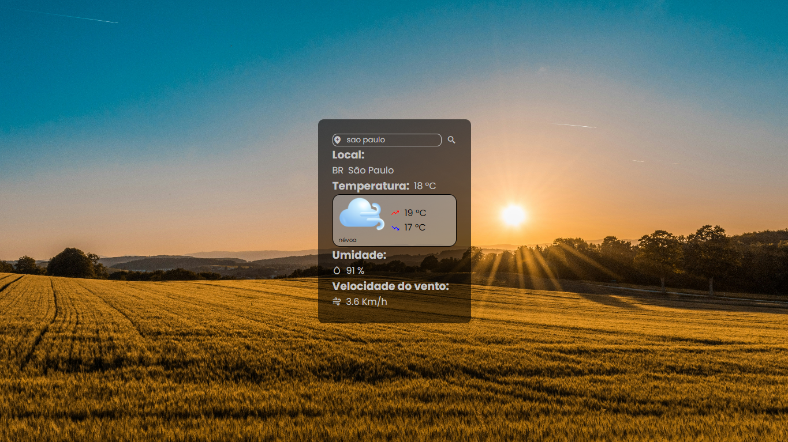

<h1 align="center">Front-End CodeBurguer</h1>

<h2>Olá sejam bem-vindo</h2>

☀️Clima para hoje: sua dose de informação atualizada

Refiz meu projeto de previsão do tempo, utilizando HTML, CSS, JavaScript e API! Para obter dados em tempo real.

<h4>O que há de novo?</h4>
<ul>
<li>Design mais intuitivo e bonito: navegue com facilidade e visualize as informações de forma clara e organizada.</li>
<li>Dados em tempo real: a API integrada garante que você tenha acesso às últimas atualizações do clima, sempre fresquinhas!</li>
<li>Previsão detalhada para o dia: saiba a temperatura, a sensação térmica, a umidade, a chance de chuva e muito mais, a cada hora do dia.</li>
</ul>

Para ver a previsão do tempo para hoje, acesse o link

<h4>Link:</h4>

> Deploy: https://daliosy.github.io/weather-forecast

> Portfólio: https://daliosy.github.io/my-PORTFOLIO

> Linkedin: https://www.linkedin.com/in/dalio-s-yamada/

#previsaotempo #desenvolvedorweb #javascript #html #css

 

  <ul align="center">
    <h2 style="display: inline-block">Imagens:</h2>
  </ul>

 
  
  
  
  
 

